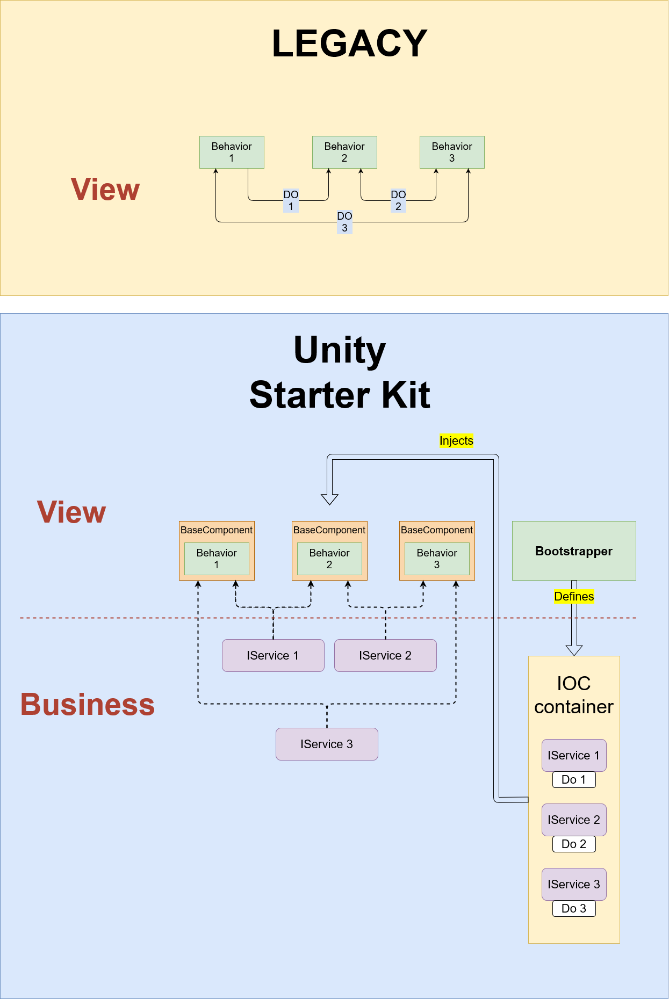

# UnityStarterKit

The UnityStarterKit assembly provides a foundation brick that is used to develop virtual reality applications.
Using this starter kit, you can easily do dependency injection in your application, improve the backend quality code, make REST or SOAP API calls, etc... without external code dependencies !

---

### &#9989; Starter kit origins



---

### &#9989; BaseComponent.cs

Base class that must be inherited by all created Monobehavior scripts.

```c#
public abstract class BaseComponent : MonoBehaviour
{
    ...
    private void InjectServices() { ... }
    ...
    private void CheckBindableObjects() { ... }
    ...
    private void CheckComponentObjects() { ... }
    ...
    protected virtual void InitializeComponent() { }
    protected virtual void UseComponent() { }
    protected virtual void UnuseComponent() { }
    protected virtual void DestroyComponent() { }
    ...
}
```

This class allows :

&#10004; Dependency injection by calling **InjectServices** method.

> **&#x2139;** Injected services must be decorated of the attribute **[InjectableService]**.

&#10004; The checking of the non-nullity of _public_ fields (can be usefull for the bindings with Unity Game Objects that can be lost &#128530;) by calling **CheckBindableObjects** method.

> **&#x2139;** These fields must be decorated of the attribute **[BindableObject]**.

&#10004; The checking of the non-nullity of _private_ and _protected_ fields built at runtime (and so prevent execeptions &#128516;) via l'appel � la m�thode **CheckComponentObjects**.

> **&#x2139;** These fields must be decorated of the attribute **[ComponentObject]**.

&#10004; A better code structure because it provides a clear set of methods to better manage the script lifecycle :

&#49;&#65039;&#8419; **InitializeComponent** invoked by the _Awake_ method, to `instanciate` private fields and do some initializations.

&#50;&#65039;&#8419; **UseComponent** called by the _Start_ method, to `subscribe` to external objects events.

&#51;&#65039;&#8419; **UnuseComponent** called by the _OnDestroy_ method, to `unsubscribe` from external objects events.

&#52;&#65039;&#8419; **DestroyComponent** invoked by the _OnDestroy_ method too, to `destroy` Game Objects generated during this script execution.

---

### &#9989; Bootstrapper.cs

This class registeres all services used by the application.

These must inherit the interface **IServiceModule** and are stored in a container inside the singleton **IUnityServiceLocator**.

> **&#x26A0;** Your implementation of the bootstrapper must be the first script to be **executed** ([see unity documentation](https://docs.unity3d.com/Manual/class-MonoManager.html)).

```c#
public abstract class Bootstrapper : UnityEngine.MonoBehaviour
{
    ...
    protected abstract void RegisterServices(IUnityServiceContainerBuilder builder);
    ...
}
```

This abstract class defines only one method **RegisterServices(...)** that allows to register all services of type **IServiceModule** and therefore injects them later in the application.

To do this :

&#x21AA; At `Awake`, a container is created in which we add all the services. Then this container is sent to the **ServiceLocator** class which "mount" it as its main container.  
&#x21AA; At `Start`, the **ServiceLocator** starts all registered services (form now on they can be injected).  
&#x21AA; Au `OnDestroy`, the **ServiceLocator** stops all services and unmount the container.

---

### &#9989; UnityServiceLocator.cs

The **UnityServiceLocator** holds every registered **IServiceModule**.

---

### &#9989; IMainthreadService.cs

The **IMainthreadService** dispatch actions on UI thread.

```c#
public interface IMainThreadService : IServiceModule
{
    event EventHandler<System.Action> NewActionExecuted;

    void DispatchActionOnMainThread(System.Action action);
}
```

> **&#x26A0;** An excessive use of this service can block the UI.

&#x21AA; The method **DispatchActionOnMainThread(...)** push a new action that must be made on UI thread (ex: update a text on screen after a REST API call made in another thread).  
&#x21AA; The event **NewActionExecuted** notify the **MainThreadBehavior** to enqueue the action to be executed on main thread (30 queues are created by default to minimize congestion).
During the `Update` sequence, actions are dequeue and executed as long as there is..

```c#
private void Update()
{
    lock (asyncTasksQueue)
    {
        if (asyncTasksQueue.Count > 0)
        {
            if (asyncTasksQueue.TryDequeue(out Action action))
            {
                action.Invoke();
            }
        }
    }
}
```

---

### &#9989; SoapExecute.cs

Provides a standard to make SOAP requests.

```c#
public abstract class SoapExecute<_IN_, _OUT_> : SoapExecute
{
    protected async Task<SoapExecuteOutput<_OUT_>> _Execute_(SoapExecuteInput<_IN_> input) { ... }

    protected abstract ISoapRequestEnvelope BuildRequest(_IN_ input);

    protected abstract _OUT_ BuildResponse(ISoapResponseEnvelope soapResponseEnvelope);
}

public abstract class SoapExecute<_OUT_> : SoapExecute
{
    protected async Task<SoapExecuteOutput<_OUT_>> _Execute_(SoapExecuteInput input) { ... }

    protected abstract ISoapRequestEnvelope BuildRequest();

    protected abstract _OUT_ BuildResponse(ISoapResponseEnvelope soapResponseEnvelope);
}
```

&#x27A1; **SoapExecuteInput<\_IN\_>** contains (or not) the entry **\_IN\_**, the URI, and the request timeout.  
&#x27A1; **SoapExecuteOutput<\_OUT\_>** contains out datas **\_OUT\_** and the request time execution.

> **&#x2139;** The request and response envelopes must respectively implement the interfaces **ISoapRequestEnvelope** & **ISoapResponseEnvelope**.
